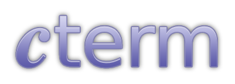

  
Is a tiny, cross-platform terminal emulator (written in C).

#### Note
macOS won't build as libmaus doesn't have implementations for it. If you would
be interested in making one for your own platform, it would be amazing if you
could contribute!

### Building:
``` sh
meson setup build
meson compile -C build
```

If you don't have access to meson or don't want to install it, clone the
libmaus repo and follow the manual build options there. An example compile for
X11 would be like so:
``` sh
cc -Iinclude source/cterm.c source/draw.c source/font.c source/term.c source/utils.c \
   /path/to/libmaus_x11.a -I/path/to/libmaus/include -I./ -lX11 -lXext -lXi -o cterm
```

### About
cterm is a tiny terminal emulator I built from frustrations of not being able
to use [st](https://st.suckless.org/) between different platforms. Like st,
it's very, smalle. Even more so than st itself.

For this reason, cterm lacks the "standard" terminal emulator features such as
mouse selection, scrollback, fancy graphics, configuration files, the like;
this is because, I don't need them. I achieve similar behavior just by, using a
terminal multiplexer or even just VIM.

cterm also doesn't rely on any extra dependancies like
[FreeType](https://freetype.org/). It uses libmaus as a Meson subproject;
libmaus is a really small windowing library I made so that it can be cross
platform.

### Info
Only BDF fonts are supported as for now. If requested (or contributed), I have
no problem with adding other formats but no vector font support! If you want to
convert your vector font, you can use something like `otf2bdf`.
> There is also a  provided which
> uses `otf2ttf` to scale any font in a libary if needed.

Reloading the font can be done with `AltR + r` by default. See the config for
more info on keybinds

